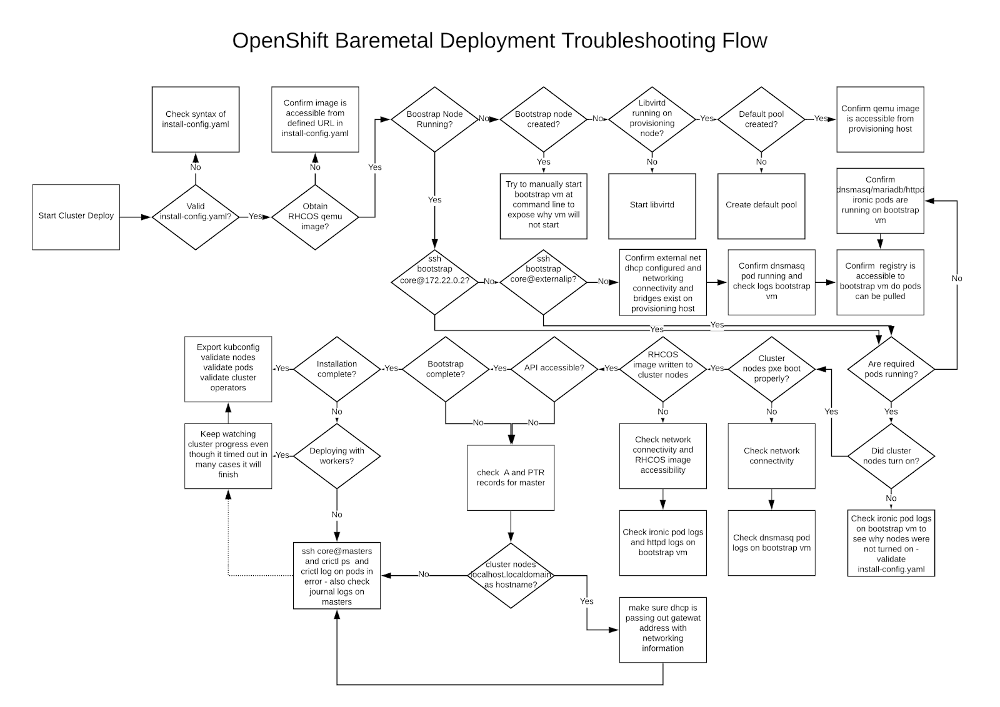

# Troubleshooting Guide for BM IPI Deployments


* [Troubleshooting Overview](#troubleshooting-overview)

* [Bootstrap VM issues](#bootstrap-vm-issues)

* [Inspecting Logs](#inspecting-logs)

* [Following the Installation](#following-the-installation) 

* [Post install pod errors](#post-install-pod-errors)

* [NTP out of sync](#ntp-out-of-sync)

* [Registry Issues](#registry-issues) 

* [Cleaning up previous installations](cleaning-up-previous-installations)

* [Misc Issues](#misc-issues) 


## Troubleshooting Overview

While attempting to deploy Installer Provisioned Infrastructure (IPI) of OpenShift on Bare Metal (BM) you may run into a situation where you need to troubleshoot your environment. This document provides troubleshooting guidance and tips in solving common issues that may arise. 

## Troubleshooting Flow 

Prior to troubleshooting your environment, it is critical to understand the overall flow of the IPI on BM installation. The diagram below is a troubleshooting flowchart providing a step-by-step breakdown of where to start debugging your environment.



## Install-config 

The install-config.yaml represents all the nodes that will be part of your OpenShift cluster and the necessary options consisting of but not limited to `apiVersion`, `baseDomain`, `networking`, `VIPS`, `imageContentSources` etc. 

During the deployment of your OpenShift cluster, if errors occur early on due to the `install-config.yaml`, confirm the following

* Use the guidelines as mentioned in the [Yaml-tips](https://www.redhat.com/sysadmin/yaml-tips)
* Verifying syntax is correct within your YAML using [syntax-check](http://www.yamllint.com/)
* Verify the RHCOS qemu images are properly defined and accessible via the URL provided in the `install-config.yaml`.

## Bootstrap VM issues 

The bootstrap node is a virtual machine that is triggered by the OpenShift installer that handles the provisioning of the nodes that will be part of the OpenShift cluster.

Once the deployment is triggered (after waiting for 10 to 15 minutes) we can see if the Bootstrap VM is operational. We can verify the bootstrap VM is operational via the `virsh` command.

```
[kni@provisioner]$ sudo virsh list
 Id    Name                           State
----------------------------------------------------
 12    kni7-xf6fq-bootstrap           running
```

If no bootstrap VM is running after waiting 10-15 minutes, it is important to troubleshoot as to why it was not created. Possible issues to verify are:

* Verify `libvirtd` is running on the system

```
$ systemctl status libvirtd
● libvirtd.service - Virtualization daemon
   Loaded: loaded (/usr/lib/systemd/system/libvirtd.service; enabled; vendor preset: enabled)
   Active: active (running) since Tue 2020-03-03 21:21:07 UTC; 3 weeks 5 days ago
     Docs: man:libvirtd(8)
           https://libvirt.org
 Main PID: 9850 (libvirtd)
    Tasks: 20 (limit: 32768)
   Memory: 74.8M
   CGroup: /system.slice/libvirtd.service
           ├─ 9850 /usr/sbin/libvirtd
```


If the bootstrap VM is indeed operational, we want to verify if we can log into it. The IP of this VM can be obtained by issuing `sudo virsh net-dhcp-leases` Typically, the private IP of the bootstrap VM is `172.22.0.2`. To access the VM use the  `core` user for logging in. 

We can find the IP address of the bootstrap VM using the `virsh console` command as shown. 
 
```sh
[kni@provisioner ~]$ sudo virsh console kni7-4q49b-bootstrap
Connected to domain kni7-4q49b-bootstrap
Escape character is ^]

Red Hat Enterprise Linux CoreOS 43.81.202001142154.0 (Ootpa) 4.3
SSH host key: SHA256:BRWJktXZgQQRY5zjuAV0IKZ4WM7i4TiUyMVanqu9Pqg (ED25519)
SSH host key: SHA256:7+iKGA7VtG5szmk2jB5gl/5EZ+SNcJ3a2g23o0lnIio (ECDSA)
SSH host key: SHA256:DH5VWhvhvagOTaLsYiVNse9ca+ZSW/30OOMed8rIGOc (RSA)
ens3:  fd35:919d:4042:2:c7ed:9a9f:a9ec:7
ens4: 172.22.0.2 fe80::1d05:e52e:be5d:263f
localhost login: 
```

* Once the IP address has been obtained, we can attempt to login to the bootstrap VM using the `ssh` command 

```
$ ssh core@172.22.0.2
```

If attempting to log into the bootstrap VM and you are not successful, you've likely reached one of the following scenarios:
* Cannot reach the `172.22.0.0/24` network. 
  This means you should verify your connectivity on the provisioning host specifically around the provisioning network bridge

* Cannot reach the bootstrap VM via the public network. When attempting to SSH via baremetal network you should verify your connectivity on the provisioning host specifically around the baremetal network bridge. 

* `Permission denied (publickey,password,keyboard-interactive)`.
  When attempting to access the bootstrap VM an error of Permission denied might occur, verify that your SSH key for the user attempting to log into the VM is set within your install-config.yaml file.

## Inspecting Logs


* bootstrapVM cannot download RHCOS image

After the bootstrap VM goes up comes a phase where podman raises 2 containers:

```
ipa-downloader
coreos-downloader
```

These both containers will download resources from the registry.This is the relevant section where is this step performed, modify it in order to let the provisioner to access to the resources:


```yaml
bootstrapOSImage: http://[<IPv4/Ipv6-IP-Registry]/rhcos-43.81.202001142154.0-qemu.x86_64.qcow2.gz?sha256=9d999f55ff1d44f7ed7c106508e5deecd04dc3c06095d34d36bf1cd127837e0c
clusterOSImage: http://[<IPv4/Ipv6-IP-Registry>]/rhcos-43.81.202001142154.0-openstack.x86_64.qcow2.gz?sha256=a1bda656fa0892f7b936fdc6b6a6086bddaed5dafacedcd7a1e811abb78fe3b0
```
Check the status of these containers using 

```
#podman logs -f ipa-downloader

#podman logs -f coreos-downloader
``` 

* There can be scenario where there is a problem in the `baremetal` network which uses external registry(quay.io) to download the images, make use of `curl` command to confirm that you can reach the registry. 

* If using a caching webserver to host the images, bootstrap VM cannot access the URL and verify it is correct.  

With the ability to login to the bootstrap VM 

```
$ ssh -i ~/.ssh/id_rsa core@172.22.0.2
```

Issue the `journalctl` command to inspect the `bootkube` logs which shows all the containers which spin up during the deployment phase(you can follow along this log) by:

```
[core@localhost ~]$ journalctl -b -f -u bootkube.service
```

Verify all the pods(`dnsmasq`, `mariadb`, `httpd`, `ironic` pods etc) are in running state using `sudo podman ps` command(which displays the containers). 

If there are issues with the pods, check the logs of all the containers with issues , use the below command for an example on how to check the log of the `ironic-apis`:

Ex: 

`sudo podman logs <container-name/container-id>`

```
sudo podman logs ironic-api
```

## Bootstrap VM cannot boot up my cluster nodes

During the deployment, it is possible for the bootstrap VM to not boot up the OpenShift cluster nodes in order to provision them with their respective RHCOS OS image. This issue can arise due to:

* Problem with the `install-config.yaml` file
* Issues with Out of band network access from the baremetal network

To verify the issue, there are 3 basic containers related to `ironic` 


    * Ironic-api
    * Ironic-conductor
    * Ironic-inspector

The `ironic-conductor` pod includes the most details regarding the attempted boot up of your OpenShift cluster nodes as it attempts to perform the login and execute the action over IPMI, you can check the logs as per the below syntax

```
# podman logs -f ironic-conductor
```
If you encounter an issue where the master nodes are not booting up via PXE, check the `ironic-conductor` pod

Potential reason: They might be in `ON`  state when deployment started.

Solution: Make sure to power off the master nodes before you begin the installation via iDRAC/iLOM.
Feel free to use this below script:
```
#!/bin/bash

echo "***Power Off master-0,master1,master-2****"
ipmitool -I lanplus -U root -P <Password> -H <Out-of-band-ip> power off
ipmitool -I lanplus -U root -P <Password> -H <Out-of-band-ip> power off
ipmitool -I lanplus -U root -P <Password> -H <Out-of-band-ip> power off
```

## Cluster nodes won’t PXE
 
* Check the network connectivity to your `Provisioning` Network(172.22.0.0/24).
* Make sure to have PXE enabled on the provisioning NIC and PXE disabled for all other NICs.
* Verify you have the proper boot MAC address(provisioning NIC MAC address) and hardware profiles in `install-config.yaml` file. 

Master node settings 
```
bootMACAddress: 24:6E:96:1B:96:90 # MAC of bootable internal NIC
hardwareProfile: default          #master node settings
```

Worker node settings
```
bootMACAddress: 24:6E:96:1B:96:90 # MAC of bootable internal NIC
hardwareProfile: unknown          #worker node settings
```

## API not accessible 

* Make sure your name resolutions are properly set in the DNS server, make use of `dig` and `nslookup` commands. 

* `SSH` into the OpenShift cluster and make sure they are getting the FQDN and not just `localhost.localdomain`.  

## Review Install 

* Confirm whether the cluster is `Ready` using

```
$ oc get nodes
NAME                   STATUS   ROLES           AGE  VERSION
master-0.example.com   Ready    master,worker   4h   v1.16.2
master-1.example.com   Ready    master,worker   4h   v1.16.2
master-2.example.com   Ready    master,worker   4h   v1.16.2
```
* Confirm all pods are successfully deployed. 

```
$ oc get pods --all-namespaces | grep -iv running | grep -iv complete 
```

## Following the Installation

During the deployment process, we can check its overall status by issuing the `tail` command to the log file `.openshift_install.log` which will be under the install directory folder.

```
# tail -f /path/to/install-dir/.openshift_install.log 
```

## Post install pod errors

* Error in metal3 pod during deployment(only applies for 4.3)

```
$ oc get all -n openshift-machine-api
NAME                                          READY   STATUS                            RESTARTS   AGE
pod/metal3-6c6cc7c56c-lj4lr                   0/8     Init:CreateContainerConfigError   0          <invalid>
```
This happens due to the missing `ConfigMap` 

```
  Warning  Failed     <invalid> (x7 over 32s)  kubelet, master-1.kni7.cloud.lab.eng.bos.redhat.com  Error: configmap "metal3-config" not found
```
Make sure to add the ConfigMap before starting the deployment as shown below to solve the above problem

Create your metal3-config.yaml file as shown below 

```yaml
 apiVersion: v1
 kind: ConfigMap
 metadata:
   name: metal3-config
   namespace: openshift-machine-api
 data:
   cache_url: rhcos-43.81.202001142154.0-qemu.x86_64.qcow2.gz
   deploy_kernel_url: http://172.22.0.1:6180/images/ironic-python-agent.kernel
   deploy_ramdisk_url: http://172.22.0.1:6180/images/ironic-python-agent.initramfs
   dhcp_range: 172.22.0.10,172.22.0.100
   http_port: "6180"
   ironic_endpoint: http://172.22.0.1:6385/v1/
   ironic_inspector_endpoint: http://172.22.0.3:5050/v1/
   provisioning_interface: eno1
   provisioning_ip: 172.22.0.1/24
   rhcos_image_url: <URL-which-has-qcow-image>
```

**Note**: Change your `rhcos_image_url` to the appropriate URL for your deployment. 

Place this file in `<Install-Dir>` 

```
$ cp metal3-config.yaml ocp/openshift/99_metal3-config.yaml 
```

and then re-run the installation to fix the metal3 pod issue. 

After the installation is complete copy the config file to the `~/.kube/config` dir to interact with the cluster

```
export KUBECONFIG=/install-dir/ocp/auth/kubeconfig
```

Verify if all the OpenShift nodes are up and running 

```
oc get nodes
NAME                                         STATUS   ROLES           AGE    VERSION
master-0.cloud.lab.eng.bos.redhat.com   Ready    master,worker   4h   v1.16.2
master-1.cloud.lab.eng.bos.redhat.com   Ready    master,worker   4h   v1.16.2
master-2.cloud.lab.eng.bos.redhat.com   Ready    master,worker   4h   v1.16.2
```
If the installation fails:

1. Please check for logs `.openshift-install.log` .

2. Master Node in `NotReady` state.

If any of the OpenShift nodes are in `NotReady` state, make sure the kubelet services are enabled

```
$ oc get nodes
NAME                                         STATUS     ROLES    AGE   VERSION
master-0.kni7.cloud.lab.eng.bos.redhat.com   NotReady   master   67m   v1.16.2
master-1.kni7.cloud.lab.eng.bos.redhat.com   Ready      master   67m   v1.16.2
master-2.kni7.cloud.lab.eng.bos.redhat.com   Ready      master   67m   v1.16.2
``` 
Verify kubelet on each master node, example of logging in to `master-0` below

```
[kni@provisioner~]$ssh core@master-0

[core@master-0 ~]$ sudo systemctl status kubelet
● kubelet.service - Kubernetes Kubelet
   Loaded: loaded (/etc/systemd/system/kubelet.service; enabled; vendor preset: enabled)
  Drop-In: /etc/systemd/system/kubelet.service.d
           └─10-default-env.conf, 20-nodenet.conf
   Active: inactive (dead) since Tue 2020-03-10 16:05:14 UTC; 33s ago
 Main PID: 2358 (code=exited, status=0/SUCCESS)
      CPU: 3min 34.752s
```

Start the kubelet services and check back the status of the node.

```
[core@master-0 ~]$ sudo systemctl start kubelet
[core@master-0 ~]$ sudo systemctl status kubelet
● kubelet.service - Kubernetes Kubelet
   Loaded: loaded (/etc/systemd/system/kubelet.service; enabled; vendor preset: enabled)
  Drop-In: /etc/systemd/system/kubelet.service.d
           └─10-default-env.conf, 20-nodenet.conf
   Active: active (running) since Tue 2020-03-10 16:07:27 UTC; 4s ago

$ oc get nodes
NAME                                         STATUS   ROLES    AGE   VERSION
master-0.kni7.cloud.lab.eng.bos.redhat.com   Ready    master   80m   v1.16.2
master-1.kni7.cloud.lab.eng.bos.redhat.com   Ready    master   80m   v1.16.2
master-2.kni7.cloud.lab.eng.bos.redhat.com   Ready    master   80m   v1.16.2
``` 
 
## NTP out of sync 

The deployment of OpenShift clusters depends on having synced time. Without synced time, the deployment will fail as ensuring time consistency is of the utmost important when talking about clusters. For example, notice the AGE of the nodes below.

```
$ oc get nodes
NAME                                         STATUS   ROLES    AGE   VERSION
master-0.kni7.cloud.lab.eng.bos.redhat.com   Ready    master   145m   v1.16.2
master-1.kni7.cloud.lab.eng.bos.redhat.com   Ready    master   135m   v1.16.2
master-2.kni7.cloud.lab.eng.bos.redhat.com   Ready    master   145m   v1.16.2
worker-2.kni7.cloud.lab.eng.bos.redhat.com   Ready    worker   100m  v1.16.2
```

This leads to inconsistent timing delays as shown below

```
# oc get bmh -n openshift-machine-api
master-1   error    registering              kni7-master-1         ipmi://[fd35:919d:4042:2:c7ed:9a9f:a9ec:102]  

#sudo timedatectl
               Local time: Tue 2020-03-10 18:20:02 UTC
           Universal time: Tue 2020-03-10 18:20:02 UTC
                 RTC time: Tue 2020-03-10 18:36:53
                Time zone: UTC (UTC, +0000)
System clock synchronized: no
              NTP service: active
          RTC in local TZ: no
```

This can be fixed by following the below steps.
 
1. Add  chrony.conf file and encode it as base64. For example: 

```
cat << EOF | base 64
server registry.kni7.cloud.lab.eng.bos.redhat.com
driftfile /var/lib/chrony/drift
logdir /var/log/chrony
log measurements statistics tracking
keyfile /etc/chrony.keys
commandkey 24
local stratum 10
initstepslew 20 registry.kni7.cloud.lab.eng.bos.redhat.com
logchange 0.5
allow fd35:919d:4042:2::1000 #IP-address-of-NTP-server
EOF 
[text-in-base-64] 
```
2. Create the MachineConfig file, replacing the base64 string with the one you just created yourself. This example adds the file to master nodes. You can change it to worker or make an additional MachineConfig for the worker role: 
```
cat << EOF > ./99_masters-chrony-configuration.yaml 
apiVersion: machineconfiguration.openshift.io/v1
kind: MachineConfig
metadata:
  creationTimestamp: null
  labels:
    machineconfiguration.openshift.io/role: master
  name: 99-master-etc-chrony-conf
spec:
  config:
    ignition:
      config: {}
      security:
        tls: {}
      timeouts: {}
      version: 2.2.0
    networkd: {}
    passwd: {}
    storage:
      files:
      - contents:
          source: data:text/plain;charset=utf-8;base64,[text-in-base-64] 
          verification: {}
        filesystem: root
        group:
          name: root
        mode: 420
        path: /etc/chrony.conf
        user:
          name: root
    systemd: {}
  osImageURL: ""
```
3. Make a backup copy of the configuration file. 

4. If doing a clean deployment, generate manifest files, add this file to the openshift directory, then continue to create the cluster.

```
$ cp chrony-masters.yaml <Install-Dir>/ocp/openshift/99_masters-chrony-configuration.yaml 
```

5. If the cluster is already running, apply the file as follows: 

```
# oc apply -f ./masters-chrony-configuration.yaml
sudo timedatectl
               Local time: Tue 2020-03-10 19:10:02 UTC
           Universal time: Tue 2020-03-10 19:10:02 UTC
                 RTC time: Tue 2020-03-10 19:36:53
                Time zone: UTC (UTC, +0000)
System clock synchronized: yes
              NTP service: active
          RTC in local TZ: no
```

## Cleaning up previous installations

If re-running the deployment, delete all the older bootstrap VMs including its volume as shown below. Failure to do so will cause future deployment failures.

Clean up the older VMs and their volumes with the help of below script. 

```
BOOTSTRAP=$(virsh list --all | grep "$CLUSTER.*bootstrap" | tail -1 | awk '{print $2}')
virsh destroy $BOOTSTRAP
virsh undefine $BOOTSTRAP
virsh vol-delete $BOOTSTRAP default
virsh vol-delete $BOOTSTRAP.ign default
```

## Registry Issues

At times, there may be a need to create a disconnected registry due to limited connectivity to an environment or creating a central location to host images locally. Details can be found in [Create a Disconnected Registry](https://docs.openshift.com/container-platform/4.3/installing/install_config/installing-restricted-networks-preparations.html#installing-restricted-networks-preparations)

**Note:** While Mirroring the registry using `oc adm release mirror` command, please make sure to add the additional registry.svc.io token to your pull-secret.json file [Add-Token](https://docs.openshift.com/container-platform/4.3/installing/install_config/installing-restricted-networks-preparations.html#Procedure) 

In the pull-secret.json file make sure to add a section for 

```
    "registry.example.com:<registry-port>": {
      "auth": "a25pOmtuaQ==",
      "email": "<your-email-id>"
    },
``` 
otherwise the mirroring process fails with 
```
oc adm -a ${LOCAL_SECRET_JSON} release mirror \
     --from=${PRODUCT_REPO}/${PROJECT}/${RELEASE_NAME}:${OCP_RELEASE} \
     --to=${LOCAL_REGISTRY}/${LOCAL_REPOSITORY} \
     --to-release-image=${LOCAL_REGISTRY}/${LOCAL_REPOSITORY}:${OCP_RELEASE}

User Not Authorized
```

After the registry is mirrored, confirm that you can access this in your disconnected environment

```
# curl -k -u <user>:<password> https://registry.example.com:<registry-port>/v2/_catalog
{"repositories":["<Repo-Name>"]}
```

## Servers not getting the correct IPv6 over DHCP

1. The reserved IPv6 addresses should be outisde your DHCP Range
2. In the reservation make sure you're using the correct MAC Address and Client ID (if supported), example below:
    
    ~~~sh
    # This is a dnsmasq dhcp reservation, 'id:00:03:00:01' is the client id and '18:db:f2:8c:d5:9f' is the MAC Address for the NIC
    id:00:03:00:01:18:db:f2:8c:d5:9f,openshift-master-1,[2620:52:0:1302::6]
    ~~~
3. Make sure Route Announcements are working and that DHCP server is listenting on the required interfaces serving the required ranges

## Servers not getting the correct hostname over DHCP

During the IPv6 deployment you need your servers to get their hostname over DHCP, we faced serveral issues when for some reason (we couldn't figure out why yet) the hostname is not assigned by NetworkManager right away.

If you login in the master nodes and you find something like this:

~~~
Failed Units: 2
  NetworkManager-wait-online.service
  nodeip-configuration.service
~~~

Your node likely booted up without hostname, which cause Kubelet to boot with `localhost.localdomain` hostname. This will cause several issues, we're going to going throught the different fixes below.

1. Force the hostname renewal

    ~~~sh
    # Check hostname, if it's localhost run below steps.
    hostname
    # Wired Connection 5 corresponds to the connection which is assigned to the NIC connected to the baremetal network, it may be different in your env
    # This will force the host to renew the dhcp lease
    sudo nmcli con up "Wired connection 5"
    # Check hostname again
    hostname
    # If the hostname is still localhost.localdomain restart NetworkManager
    sudo systemctl restart NetworkManager
    # If the hostname is still localhost.localdomain wait a few seconds/minutes and check again, if same, repeat previous steps
    ~~~
2. Restart `nodeip-configuration` service

    ~~~sh
    # This service will reconfigure Kubelet service with the correct hostname references
    sudo systemctl restart nodeip-configuration.service
    ~~~
3. Restart `kubelet` service

    ~~~sh
    # We need to reload the unit files definition since kubelet one was changed by previous step
    sudo systemctl daemon-reload
    # Restart kubelet
    sudo systemctl restart kubelet.service
    ~~~
4. Ensure `kubelet` booted with correct hostname

    ~~~sh
    # Tail the journal and find the hostname
    sudo journalctl -fu kubelet.service
    ~~~

If you already had this cluster running when the node booted up with the wrong hostname you will have pending `csrs` on the cluster, you **MUST NOT** approve them, otherwise you will face even more issues.

~~~sh
# Get CSR on the cluster
oc get csr
# If you see Pending csr ensure they are good ones
oc get csr <pending_csr> -o jsonpath='{.spec.request}' | base64 -d | openssl req -noout -text
# If you see Subject Name: localhost.localdomain remove the csr
oc delete csr <wrong_csr>
~~~

## Misc Issues 

* After cluster deployment if you see `runtime network not ready: NetworkReady=false reason:NetworkPluginNotReady message:Network plugin returns error: Missing CNI default network` we need to inspect the pods in `openshift-network-operator` namespace. 

```
oc get all -n openshift-network-operator
NAME                                    READY   STATUS              RESTARTS   AGE
pod/network-operator-69dfd7b577-bg89v   0/1     ContainerCreating   0          149m
```

The cluster network operator is responsible for deploying the networking components. It does this in response to a special object created by the installer.

From a deployment perspective, the network operator is often the "canary in the coal mine." It runs very early in the installation process, after the master nodes have come up but before the bootstrap control plane has been torn down. It can be indicative of more subtle installer issues, such as long delays in bringing up master nodes or apiserver communication issues. 

First, determine that the network configuration exists, from `provisioner` node:

```console
[kni@provisioner ~]$ kubectl get network.config.openshift.io cluster -oyaml
apiVersion: config.openshift.io/v1
kind: Network
metadata:
  name: cluster
spec:
  serviceNetwork:
  - 172.30.0.0/16
  clusterNetwork:
  - cidr: 10.128.0.0/14
    hostPrefix: 23
  networkType: OpenShiftSDN
```

If it doesn't exist, the installer didn't create it. You'll have to run `openshift-install create manifests` to determine why.

Next, check that the network-operator is running, from `provisioner` node issue:

```sh
[kni@provisioner ~]$ kubectl -n openshift-network-operator get pods
```

And retrieve the logs. Note that, on multi-master systems, the operator will perform leader election and all other operators will sleep:

```sh
kubectl -n openshift-network-operator logs -l "name=network-operator"
``` 

**Note:** For more details please refer [Troubleshooting](https://github.com/openshift/installer/blob/master/docs/user/troubleshooting.md) 

